# 🗺️ PLOT360

### **From Boundaries to Insights**

> **A unified land-governance platform for exploring parcels, understanding land records, visualizing spatial information, and accessing citizen services — all from one place.**

<p align="center">
  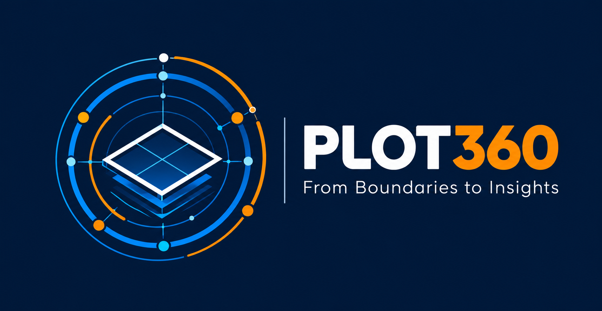
</p>

---

## ✦ What is PLOT360?

**PLOT360 brings fragmented land information into a single parcel-centric view.**

### 🔎 Explore

* Search parcels and land information
* Explore locations through an interactive map
* View parcel-level information

### 🧩 Understand

* Ownership & rights
* Registration information
* Planning & development
* Building information
* Property tax
* Utilities
* Liabilities
* Restrictions
* Historical information
* Data sources & provenance

### 📊 Analyze

* Land and parcel insights
* GIS-based visualization
* Analytics dashboards
* Satellite-based change insights
* Spatial and administrative information

### 🏛️ Access Services

* Citizen service discovery
* Application/service information
* Service tracking
* Government-facing workflows

---

## ⚡ PLOT360 at a Glance

```text
                    ┌─────────────────────┐
                    │       PLOT360       │
                    │   Land Intelligence │
                    └──────────┬──────────┘
                               │
          ┌────────────────────┼────────────────────┐
          ↓                    ↓                    ↓
   LAND EXPLORER       PARCEL INTELLIGENCE   GOVERNANCE & RECORDS
          │                    │                    │
          └────────────────────┼────────────────────┘
                               ↓
                    PLANNING & DEVELOPMENT
                               │
          ┌────────────────────┼────────────────────┐
          ↓                    ↓                    ↓
       GIS MAPS          ANALYTICS & AI       CITIZEN SERVICES
          │                    │                    │
          └────────────────────┼────────────────────┘
                               ↓
                     CONNECTED LAND VIEW
```

---

# 🚀 Core Features

| Module                            | Key Capabilities                                                       |
| --------------------------------- | ---------------------------------------------------------------------- |
| 🗺️ **Land Explorer**             | Parcel search • Location exploration • Map-based discovery             |
| 📍 **Parcel Intelligence**        | Parcel overview • Ownership • Rights • Registration • History          |
| 🏛️ **Governance & Records**      | Land records • Restrictions • Liabilities • Data sources               |
| 🏗️ **Planning & Development**    | Planning information • Building information • Development context      |
| 🌐 **GIS & Spatial Intelligence** | Interactive maps • Layer visualization • Spatial exploration           |
| 🛰️ **Satellite Insights**        | Multi-temporal satellite comparison • Change visualization             |
| 📊 **Analytics & AI**             | Land analytics • Visual insights • Decision-support views              |
| 👥 **Citizen Services**           | Service discovery • Applications • Tracking • Citizen-facing workflows |
| 🔐 **Administration & Security**  | Role-based access • Audit-oriented controls • Data governance          |

---

# 🧭 Parcel-Centric Workflow

```text
        SEARCH
          ↓
   Select Parcel / Location
          ↓
   ┌──────────────────────┐
   │   PARCEL OVERVIEW    │
   └──────────┬───────────┘
              ↓
 ┌────────────┼─────────────┐
 ↓            ↓             ↓
OWNERSHIP   RECORDS      PLANNING
 ↓            ↓             ↓
RIGHTS     REGISTRATION   BUILDING
 └────────────┼─────────────┘
              ↓
       TAX • UTILITIES
              ↓
        RESTRICTIONS
              ↓
        HISTORY & DATA
              ↓
        GIS / SATELLITE
              ↓
         LAND INSIGHTS
```

---

# 🖥️ Interface Showcase

### 01 · Command Center

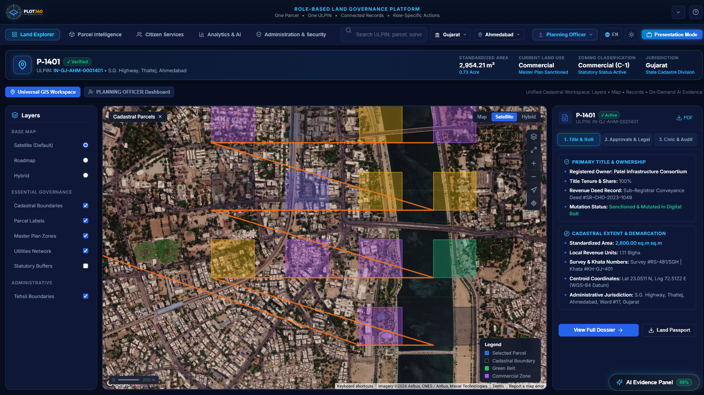

### 02 · Land Explorer

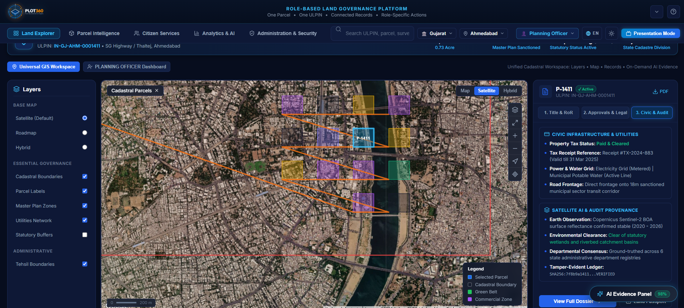

### 03 · Parcel Intelligence

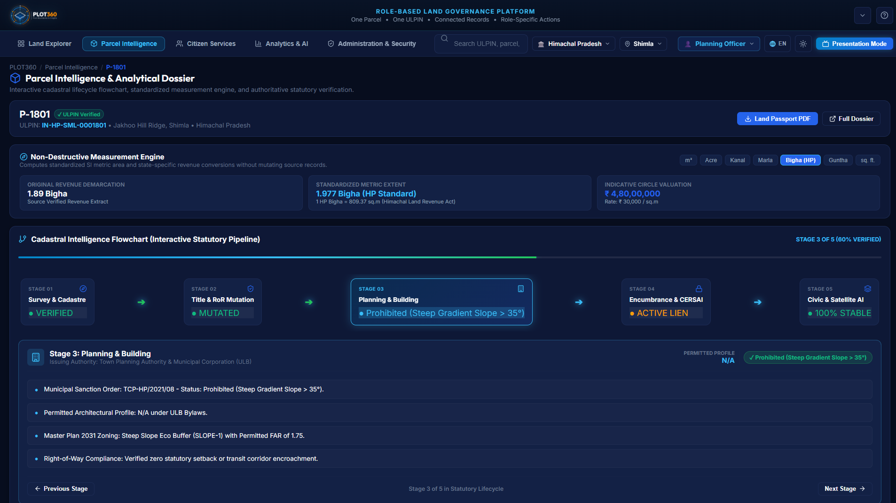

### 04 · Land Passport

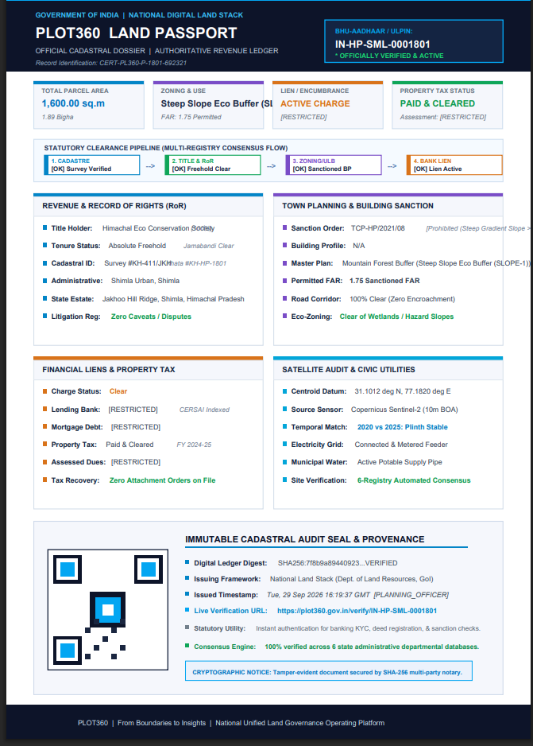

### 05 · Governance & Records

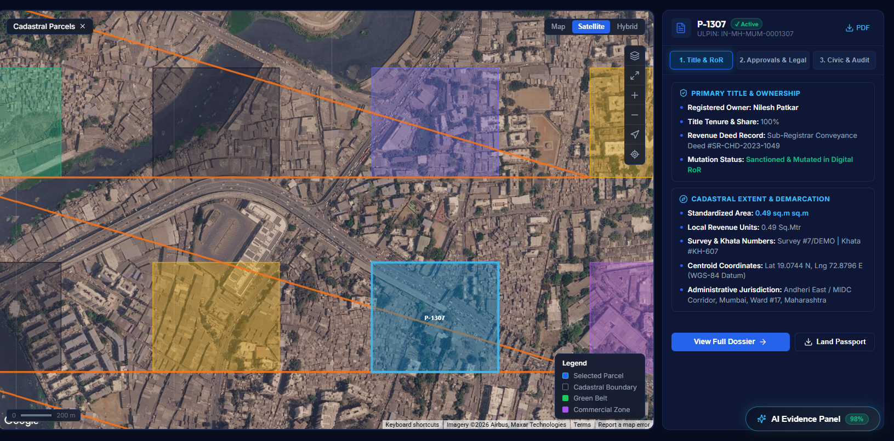

### 06 · Planning & Development

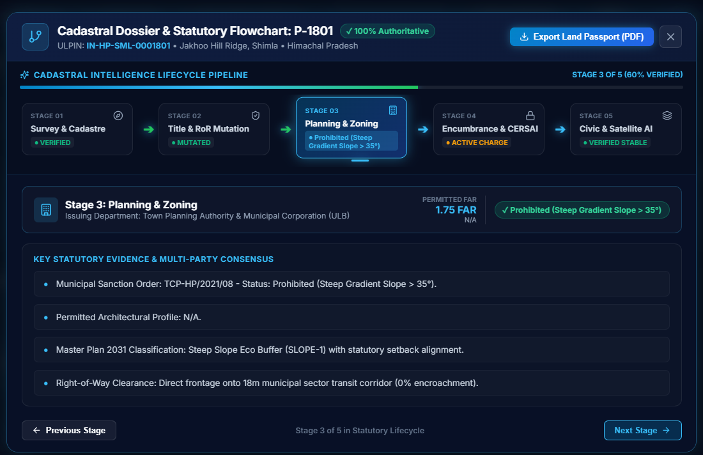

### 07 · GIS Layer Intelligence

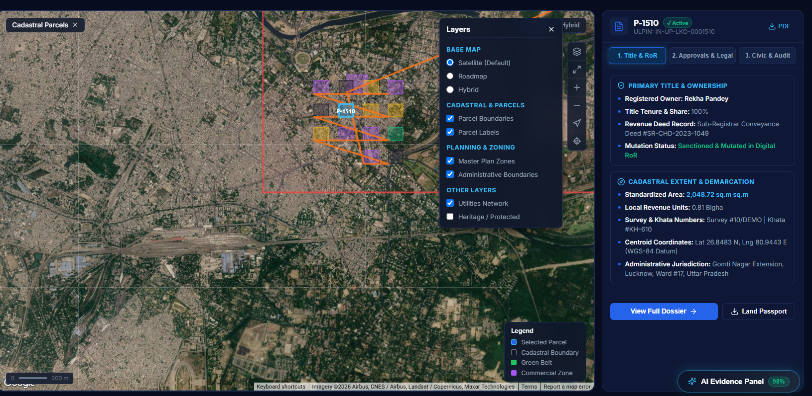

### 08 · Satellite Change Insights

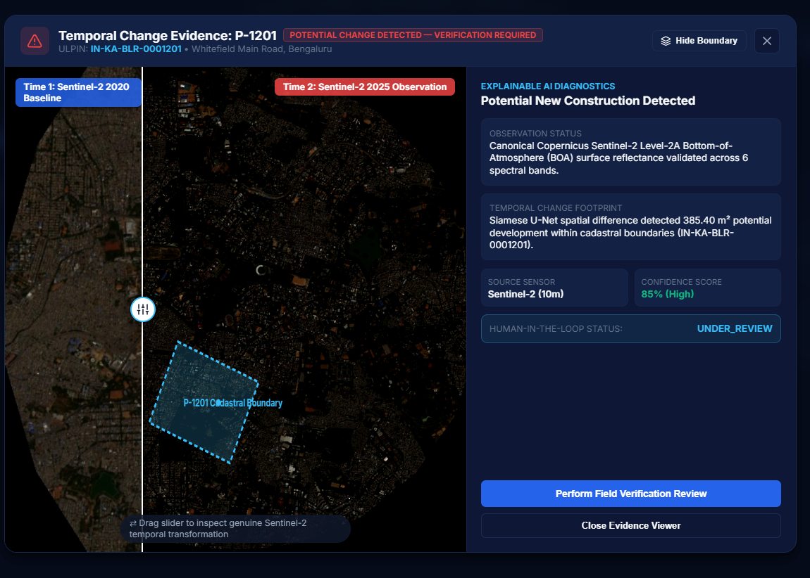

### 09 · Analytics Dashboard

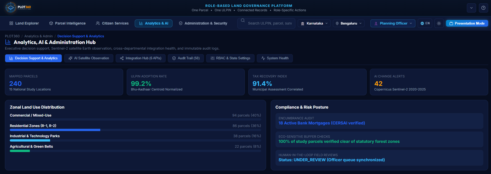

### 10 · Citizen Services

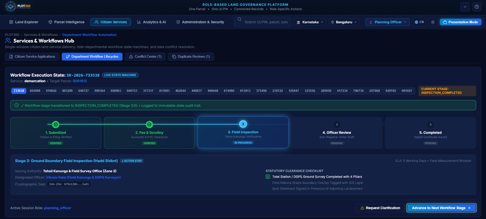

---

# 🧱 Technology Stack

```text
Frontend
   ↓
React + Vite
   ↓
Interactive UI + Dashboards + GIS Views
   ↓
FastAPI Backend
   ↓
Land Data • Records • Services • Analytics
   ↓
GIS / Satellite Intelligence
```

### Built With

* ⚛️ **React**
* ⚡ **Vite**
* 🐍 **Python / FastAPI**
* 🗺️ **GIS & Interactive Mapping**
* 🛰️ **Satellite Imagery & Change Analysis**
* 📊 **Data Visualization**
* 🔐 **Role-Based Access & Security Controls**

---

# 🔐 Data & Governance Principles

* **Parcel-centric information architecture**
* **Role-based access**
* **Data provenance & source visibility**
* **Original values preserved alongside standardized representations**
* **State-specific terminology and units**
* **Urban + rural applicability**
* **Audit-oriented workflows**
* **Clear separation between spatial evidence and official land records**
* **No autonomous alteration of official records**
* **Satellite observations treated as supporting evidence, not legal determination**

---

# 👥 Team — FUSION NOVA

* **Aayushi Kumari**
* **Twinkle Pratap**
* **Mridul Gupta**
* **Uday Kumar**
* **Prem Prakash**
* **Vikas Singla**

---

# 🌐 Live Application


**Live Demo:** [Open PLOT360](https://plot360-i6nx.onrender.com/)

---

# 📌 Project Status

**Current Stage:** Prototype / Development Build

```text
UI & Dashboards        ✓
Parcel-centric Views   ✓
GIS Interface          ✓
Analytics Views        ✓
Satellite Insights     ✓
Citizen Services       ✓
Deployment             ⏳
```

---

## ✨ PLOT360

> **Explore the land. Understand the parcel. Connect the information.**
